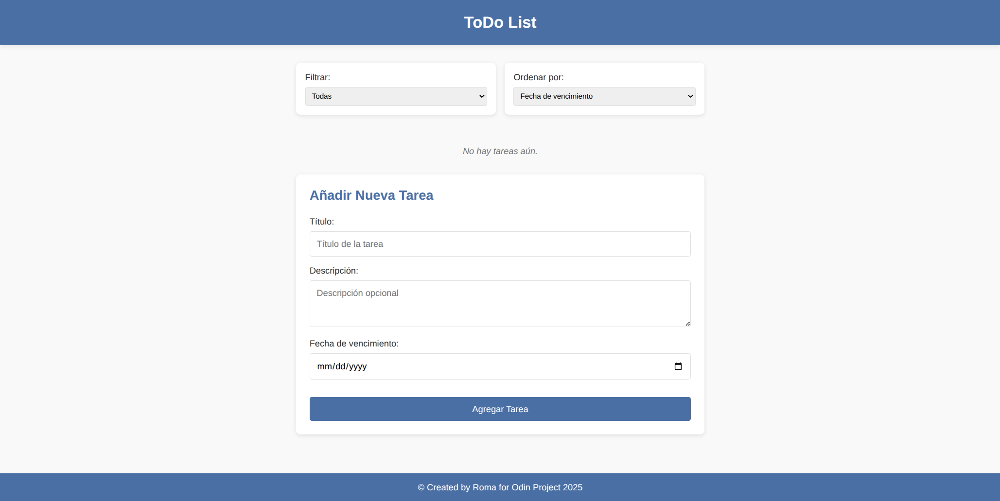

# ToDo List Application



A modern, responsive ToDo List application built with vanilla JavaScript, HTML5, and CSS3. Manage your tasks with ease, featuring filtering, sorting, and local storage persistence.

## Features

- **Task Management**
  - Add new tasks with titles, descriptions, and due dates
  - Mark tasks as complete/incomplete
  - Edit existing tasks
  - Delete tasks
  - View task details

- **Organization**
  - Filter tasks: All, Completed, or Pending
  - Sort tasks by: Due Date, Title, or Completion Status
  - Clear visual indicators for overdue tasks

- **Data Persistence**
  - Automatic saving to localStorage
  - Data persists between sessions

- **User Experience**
  - Clean, responsive interface
  - Interactive notifications
  - Form validation
  - Accessible design

## Technologies Used

- **Frontend**
  - Vanilla JavaScript (ES6+)
  - HTML5 Semantic Elements
  - CSS3 with Variables and Flexbox/Grid
  - Webpack (for module bundling)

- **Design**
  - Responsive layout (mobile-first approach)
  - Custom animations and transitions
  - Modern UI components

## Installation

1. Clone the repository:
   ```bash
   git clone https://github.com/your-username/todo-list-app.git
   ```

2. Navigate to the project directory:
   ```bash
   cd todo-list-app
   ```

3. Install dependencies:
   ```bash
   npm install
   ```

4. Start the development server:
   ```bash
   npm start
   ```

5. Open your browser and visit:
   ```
   http://localhost:3000
   ```

## Usage

1. **Adding a Task**
   - Fill in the task title (required)
   - Add an optional description
   - Set a due date (optional)
   - Click "Add Task"

2. **Managing Tasks**
   - ✔️ Checkbox: Mark as complete/incomplete
   - ✏️ Edit button: Modify task details
   - 🗑️ Delete button: Remove task

3. **Filtering & Sorting**
   - Use the "Filter" dropdown to view All/Completed/Pending tasks
   - Use the "Sort by" dropdown to organize your tasks

## Project Structure

```
src/
├── assets/          # Static assets (images, icons)
├── css/             # Stylesheets
├── js/              # JavaScript modules
│   ├── todo.js      # Todo item class
│   ├── todoList.js  # Todo list manager
│   ├── render.js    # UI rendering logic
│   ├── app.js       # Main application logic
│   └── index.js     # Entry point
├── index.html       # Main HTML file
└── README.md        # Project documentation
```

## Contributing

Contributions are welcome! Please follow these steps:

1. Fork the project
2. Create your feature branch (`git checkout -b feature/AmazingFeature`)
3. Commit your changes (`git commit -m 'Add some amazing feature'`)
4. Push to the branch (`git push origin feature/AmazingFeature`)
5. Open a Pull Request

## License

Distributed under the MIT License. See `LICENSE` for more information.

## Acknowledgements

- [Google Fonts](https://fonts.google.com/) for typography
- [Font Awesome](https://fontawesome.com/) for icons
- [Modern CSS Reset](https://github.com/hankchizljaw/modern-css-reset)
